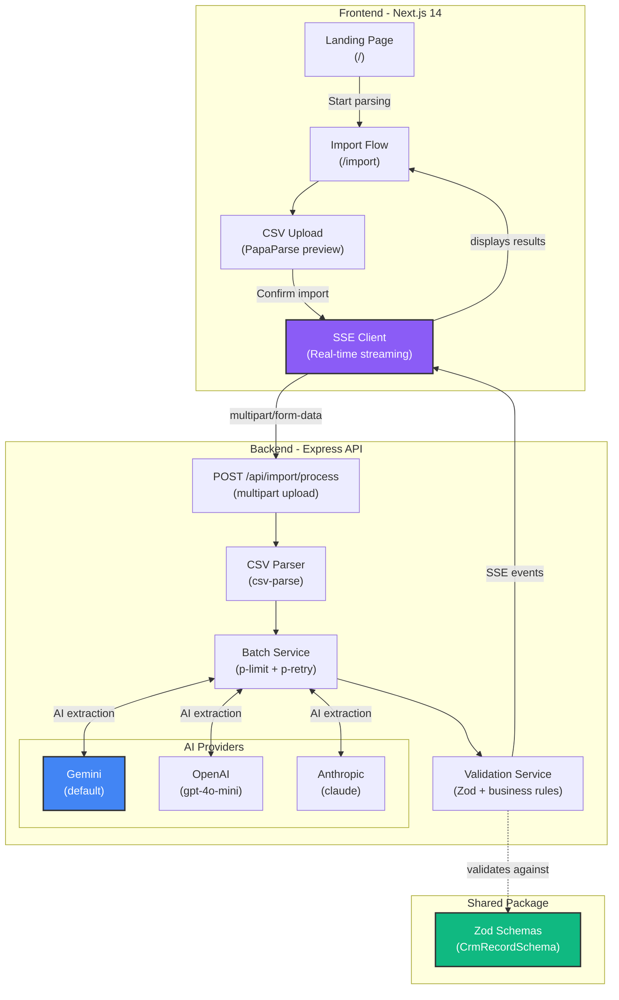
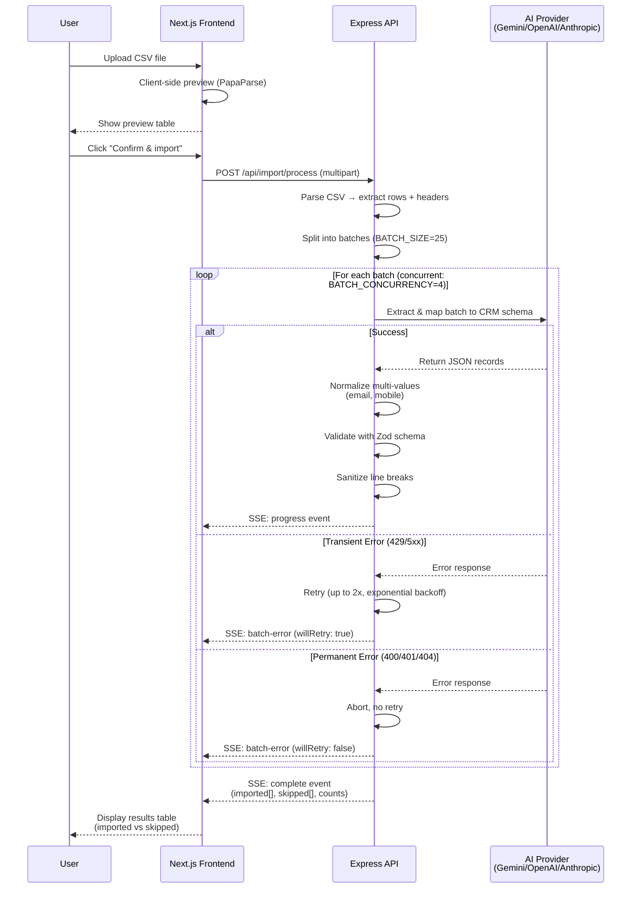

# Kinetix — AI CSV Importer

<div align="center">

An AI-powered CSV importer that maps arbitrary lead-export CSVs (Facebook Ads, Google Ads, real-estate CRM exports, manual spreadsheets — any layout) onto a fixed CRM schema.

</div>


## Architecture

**Monorepo with npm workspaces:**

```
kinetix-csv-importer/
├── apps/
│   ├── web/          # Next.js 14 frontend (landing + import flow)
│   └── api/          # Express + TypeScript backend (CSV parsing, AI, SSE)
└── packages/
    └── shared/       # Zod schemas + types (single source of truth)
```

### System Architecture



## Import Pipeline

The import process streams data in real-time through several validation layers:



### Key Design Decisions

**Provider abstraction** (`apps/api/src/providers/`)  
An `LlmProvider` interface with Gemini, OpenAI, and Anthropic implementations. Swap providers via `AI_PROVIDER` env var, no code changes. Gemini is default (free tier available).

**Defense-in-depth validation** (`validation.service.ts`)  
Every AI-returned record goes through three validation layers:
1. `normalizeMultiValueFields` — Re-derives "first email/mobile primary, rest into crm_note" rule
2. Zod schema validation — Enum membership, date parseability, field shapes
3. `sanitizeLineBreaks` — Escapes raw newlines to literal `\n` for safe CSV re-export

**SSE streaming** (not blocking POST)  
`/api/import/process` streams progress events as batches complete. UI shows real-time progress, large files don't hit timeouts.

**Batching + concurrency + smart retry**  
- Rows chunked by `BATCH_SIZE` (default 25)
- Processed with `p-limit` concurrency control (default 4)
- Retries up to 2x on transient failures (rate limits, 5xx)
- Permanent failures (bad model, auth error) abort immediately
- UI notified even when retry logic is bypassed

---

## Local Setup

**Prerequisites:** Node.js 20+, and a free API key from
[aistudio.google.com/apikey](https://aistudio.google.com/apikey) (or a paid OpenAI/Anthropic key
if you'd rather use one of those).

```bash
git clone <your-repo-url>
cd kinetix-csv-importer   # or whatever you named the folder
npm install

# Backend env
cp .env.example apps/api/.env
# edit apps/api/.env — set GEMINI_API_KEY (AI_PROVIDER already defaults to gemini)

# Frontend env
echo "NEXT_PUBLIC_API_URL=http://localhost:4000" > apps/web/.env.local

# Build the shared package first (both apps depend on its compiled output)
npm run build:shared

# Run both apps together
npm run dev
```

- Landing page: http://localhost:3000
- Import flow: http://localhost:3000/import
- Backend health check: http://localhost:4000/api/health

Two sample CSVs are in `samples/` (a Facebook-style export and a messy manual spreadsheet with
multiple emails/phones per row and one contact-less row) — use them to sanity-check the AI
mapping and the skip logic before your real data.

## Running tests

```bash
npm run test -w apps/api
```

23 tests across three suites:
- `validation.service.test.ts` — schema enforcement, multi-value email/mobile normalization,
  line-break sanitization, contact-info skip rule.
- `batch.service.test.ts` — happy path, transient-failure retry, permanent-failure abort
  (verifies retries are *not* wasted on a 404, and that the UI is still notified).
- `csv-parser.service.test.ts` — arbitrary headers, malformed CSV, BOM stripping, whitespace
  trimming, blank-line handling, and a regression check against the real sample fixtures.

## Docker

```bash
cp .env.example apps/api/.env   # fill in your API key first
docker compose up --build
```

## Deployment

**Frontend → Vercel**
1. Import the repo in Vercel, set the root directory to `apps/web`.
2. Add env var `NEXT_PUBLIC_API_URL` = your deployed backend URL.
3. Vercel auto-detects Next.js and handles the npm workspace install natively.

**Backend → Railway or Render** (not Vercel — this app uses long-lived SSE connections, which
don't fit a serverless function model well)
1. New service from the repo, root directory `apps/api` (or use the provided `Dockerfile`).
2. Set env vars from `.env.example`: `AI_PROVIDER`, `GEMINI_API_KEY`, `CORS_ORIGIN` = your
   deployed Vercel URL.
3. Expose port `4000` (or let the platform assign `$PORT` — the app reads `process.env.PORT`).

After both are live, update `CORS_ORIGIN` on the backend and `NEXT_PUBLIC_API_URL` on the
frontend to point at each other's real URLs, then redeploy.

## Environment variables

See [`.env.example`](.env.example) for the full list with defaults.

| Variable | Where | Purpose |
|---|---|---|
| `AI_PROVIDER` | api | `gemini` (default) \| `openai` \| `anthropic` |
| `GEMINI_API_KEY` | api | required if `AI_PROVIDER=gemini` |
| `GEMINI_MODEL` | api | defaults to `gemini-flash-latest` — an auto-updating alias, since Google has retired several dated Gemini model versions in 2026 |
| `OPENAI_API_KEY` / `ANTHROPIC_API_KEY` | api | only needed for those providers |
| `BATCH_SIZE` | api | rows sent to the LLM per call (default 25) |
| `BATCH_CONCURRENCY` | api | parallel in-flight batches (default 4) — lower this if you're on a rate-limited free tier |
| `MAX_UPLOAD_SIZE_MB` | api | upload size cap (default 5) |
| `CORS_ORIGIN` | api | must match the deployed frontend origin |
| `NEXT_PUBLIC_API_URL` | web | backend base URL |

## API contract

`POST /api/import/process` — `multipart/form-data`, field name `file` (a `.csv`, ≤5MB).

Response is `Content-Type: text/event-stream`, not a single JSON body. Each SSE frame's `data:`
payload is one of:

```jsonc
// Emitted after each batch finishes (success or exhausted-retries failure)
{ "type": "progress", "processed": 25, "total": 100, "batchIndex": 0, "totalBatches": 4 }

// Emitted on each failed attempt within a batch
{ "type": "batch-error", "batchIndex": 0, "message": "...", "willRetry": true }

// Emitted once, at the end, with the full result
{
  "type": "complete",
  "result": {
    "imported": [ /* CrmRecord[] */ ],
    "skipped": [ { "row": { /* original CSV row */ }, "reason": "..." } ],
    "totalImported": 92,
    "totalSkipped": 8,
    "totalProcessed": 100
  }
}

// Emitted instead of "complete" if the pipeline fails before any batch runs
// (e.g. malformed CSV, empty file, row-count limit exceeded)
{ "type": "error", "message": "..." }
```

The exact `CrmRecord` shape is defined once in `packages/shared/src/crm-record.schema.ts` and
consumed by both apps — see that file for the authoritative field list and types.

## Design decisions

See the fuller write-up from planning in `groweasy-csv-importer-plan.md` if present in your copy
of this project. In short: layered backend (`route → controller → service → provider`), a
provider-abstraction strategy pattern for the LLM, Zod as the single source of truth for both AI
output validation and the CRM business rules, and SSE for real progress instead of a blocking
request.

## Known limitations

- **Stateless by design** — per the assignment's "optional" note on databases, nothing is
  persisted. Refreshing the import page loses in-progress results.
- **CSV parsing itself is one-shot**, not streamed row-by-row — only the *AI extraction* stage is
  streamed/incremental. For very large files this is the more expensive stage anyway, so it's
  where streaming matters most.
- **Free-tier LLM rate limits** — Gemini's free tier has fairly low daily/per-minute request
  caps. Large CSVs or repeated test runs can hit `429`s; the retry logic handles transient ones
  automatically, but a sustained quota exhaustion will show up as skipped batches with a clear
  reason.
- **Multi-value normalization is regex-based**, covering the common delimiters (comma,
  semicolon, slash, "and"/"&"). Genuinely unusual formatting in a source CSV could still slip
  through to the model uninspected — the Zod schema is still the final backstop either way.

